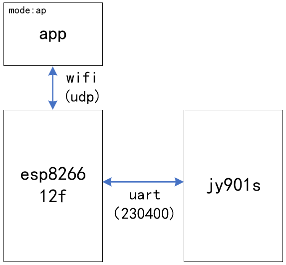

# IMUonFeet

## 一、系统结构



esp826612f与jy901s之间通过串口通信，通信波特率为230400(目前修改为115200)。

esp826612f与上位机之间通过wifi连接，使用udp协议，将jy901s的raw数据，直接发送到上位机。

## 二、系统原理图


**目前存在的问题：**

- ip5306 的key引脚要接一个按键才可以正常工作。(现在是飞了一根线)

- jy901s的封装有问题，现在使用的是贴片版本的封装，使用2.54mm的排针的版本间距要更小一些。

待优化的问题:

- 给主控和jy901s增加过压保护电路。
- 目前只有一个led, 应该再增加一个led用于指示系统的工作状态( 已连接ap状态, 已进行握手状态 )

## 三、使用

### 3.1 开关机

系统中有一个按键和一个拨动开关。

- 按键的使用：长按大于2s可以打开ip5306的输出，快速2次短按可以关闭ip5306的输出。
- 拨动开关：拨动至ON丝印处，接通3.3v至主控和jy901s的供电。

### 3.2 AP配置

上电后，主控会自动连接ssid为`imutest`, password为`imutest123`的热点。

```c
#define AP_SSID "imutest"
#define AP_PSK  "imutest123"
```

需要按照如上所示配置AP的ssid和password。

### 3.3 上位机使用

确保上位机和主控已连接同一个AP。

#### 3.3.1 PC程序

```python
import socket

remote_ip   = '192.168.19.108'
remote_port = 33333 

def hansdshake():
    sock = socket.socket(socket.AF_INET, socket.SOCK_DGRAM)
    message = "hello,imuonfeet!"
    sock.sendto(message.encode(), (remote_ip, remote_port))

    data, _ = sock.recvfrom(1024)
    if( data.decode() == "hi,imuonfeet!" ):
        print("handshake success!")
    return sock 
def running(sock):
    while True:
        data, _ = sock.recvfrom(1024)
        print(data.hex(),end="")
        
if __name__ == '__main__':
    sock = hansdshake()
    running(sock)
```

首先应该更改`remote_ip`变量的值为实际的主控的IP地址。

主控与上位机的交互逻辑：

1. 上位机向主控发送`hello,imuonfeet!`字符串，主控向上位机返回`hi,imuonfeet!`字符串，实现握手。
2. 握手成功后，主控向上位机返回数据长度为1024 byte的报文，内部为来自jy901s的数据。

**后续应增加将接收的数据保存成文件的操作，而不是简单打印**

#### 3.3.2 Android程序

TBC
